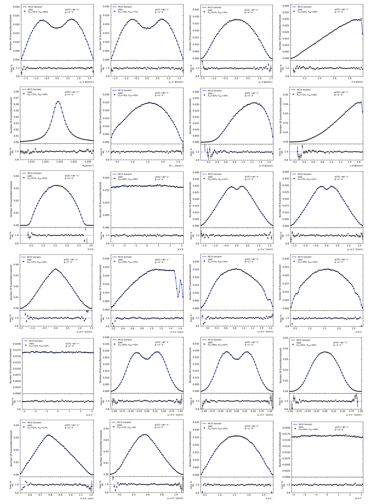

# SWD-EvtGen

## Introduction

SWD-EvtGen is a deep learning-based event generator using Sliced Wasserstein Distance for our paper  [Event Generation and Consistence Test for Physics with Sliced Wasserstein Distance](https://arxiv.org/abs/2310.17897).

## Application

- **Fast Event Generation**: Use the model trained from limited Monte Carlo (MC) simulations events to generate more events like new generated MC events.
- **Consistence Test**: Measure the distribution differences between two sets of data and provide a confidence level(p-value) for the observed discrepancies.

## Results



## Getting Started

### Installation

1. Clone the repository:
   ```bash
   git clone https://github.com/caihao/SWD-EvtGen.git
   cd SWD-EvtGen
   ```

### Train

Train the model using standard config:
```bash
cd src
python train.py --config_file ../compare_exp_configs/standard.yaml
```

You can replace the standard configs into other configs, or just modify parameters in this config.

## To-Do List

- [ ] More visualization of SWD in Physics
- [ ] Additional supportive results
- [ ] Download link for the dataset and complete results in control experiment
- [x] Write usage guides.